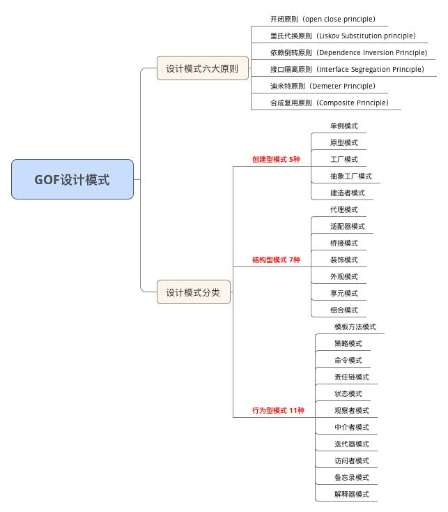

#### 先上图

#### 设计模式的六大原则
**1、开闭原则（Open Close Principle）**

开闭原则的意思是：对扩展开放，对修改关闭。在程序需要进行拓展的时候，不能去修改原有的代码，实现一个热插拔的效果。简言之，是为了使程序的扩展性好，易于维护和升级。想要达到这样的效果，我们需要使用接口和抽象类，后面的具体设计中我们会提到这点。

**2、里氏代换原则（Liskov Substitution Principle）**

里氏代换原则是面向对象设计的基本原则之一。 里氏代换原则中说，任何基类可以出现的地方，子类一定可以出现。LSP 是继承复用的基石，只有当派生类可以替换掉基类，且软件单位的功能不受到影响时，基类才能真正被复用，而派生类也能够在基类的基础上增加新的行为。里氏代换原则是对开闭原则的补充。实现开闭原则的关键步骤就是抽象化，而基类与子类的继承关系就是抽象化的具体实现，所以里氏代换原则是对实现抽象化的具体步骤的规范。

**3、依赖倒转原则（Dependence Inversion Principle）**

这个原则是开闭原则的基础，具体内容：针对接口编程，依赖于抽象而不依赖于具体。

**4、接口隔离原则（Interface Segregation Principle）**

这个原则的意思是：使用多个隔离的接口，比使用单个接口要好。它还有另外一个意思是：降低类之间的耦合度。由此可见，其实设计模式就是从大型软件架构出发、便于升级和维护的软件设计思想，它强调降低依赖，降低耦合。

**5、迪米特法则，又称最少知道原则（Demeter Principle）**

最少知道原则是指：一个实体应当尽量少地与其他实体之间发生相互作用，使得系统功能模块相对独立。

**6、合成复用原则（Composite Reuse Principle）**

合成复用原则是指：尽量使用合成/聚合的方式，而不是使用继承。

#### 23种GOF设计模式

设计模式有两种分类方法，按照目的区分，按照模式的作用范围来区分

- 按照目的区分
    - **创建型模式**
      用于描述“怎样创建对象”，它的主要特点是“将对象的创建与使用分离”，主要有几下五种：
        - 单例模式
        - 原型模式
        - 工厂方法
        - 抽象工厂
        - 建造者模式
    - **结构型模式**
      用于描述如何将类或对象按某种布局组成更大的结构，主要有7种：
        - 代理模式
        - 适配器模式
        - 桥接模式
        - 装饰模式
        - 外观模式
        - 享元模式
        - 组合模式
    - **行为型模式**
      用于描述类或对象之间怎样相互协作共同完成单个对象都无法单独完成的任务，以及怎样分配职责，GOF中包含11种：
        - 模板方法
        - 策略模式
        - 命令模式
        - 责任链模式
        - 状态模式
        - 观察者模式
        - 中介者模式
        - 迭代器模式
        - 访问者模式
        - 备忘录模式
        - 解释器模式
- 按照作用范围区分
    - **类模式**
     用于处理类与子类之间的关系，这些关系通过继承来建立，是静态的，在编译时刻便确定下来了。GoF中的工厂方法、（类）适配器、模板方法、解释器属于该模式。
    - **对象模式**
     用于处理对象之间的关系，这些关系可以通过组合或聚合来实现，在运行时刻是可以变化的，更具动态性。GoF 中除了以上 4 种，其他的都是对象模式。

#### GoF的23种设计模式的功能
前面说明了 GoF 的 23 种设计模式的分类，现在对各个模式的功能进行介绍。
- **单例（Singleton）模式**：
 某个类只能生成一个实例，该类提供了一个全局访问点供外部获取该实例，其拓展是有限多例模式。
- **原型（Prototype）模式**：
 将一个对象作为原型，通过对其进行复制而克隆出多个和原型类似的新实例。
- **工厂方法（Factory Method）模式**：
 定义一个用于创建产品的接口，由子类决定生产什么产品。
- **抽象工厂（AbstractFactory）模式**：
 提供一个创建产品族的接口，其每个子类可以生产一系列相关的产品。
- **建造者（Builder）模式**：
 将一个复杂对象分解成多个相对简单的部分，然后根据不同需要分别创建它们，最后构建成该复杂对象。
- **代理（Proxy）模式**：
 为某对象提供一种代理以控制对该对象的访问。即客户端通过代理间接地访问该对象，从而限制、增强或修改该对象的一些特性。
- **适配器（Adapter）模式**：
 将一个类的接口转换成客户希望的另外一个接口，使得原本由于接口不兼容而不能一起工作的那些类能一起工作。
- **桥接（Bridge）模式**：
 将抽象与实现分离，使它们可以独立变化。它是用组合关系代替继承关系来实现，从而降低了抽象和实现这两个可变维度的耦合度。
- **装饰（Decorator）模式**：
 动态的给对象增加一些职责，即增加其额外的功能。
- **外观（Facade）模式**：
 为多个复杂的子系统提供一个一致的接口，使这些子系统更加容易被访问。
- **享元（Flyweight）模式**：
 运用共享技术来有效地支持大量细粒度对象的复用。
- **组合（Composite）模式**：
 将对象组合成树状层次结构，使用户对单个对象和组合对象具有一致的访问性。
- **模板方法（TemplateMethod）模式**：
 定义一个操作中的算法骨架，而将算法的一些步骤延迟到子类中，使得子类可以不改变该算法结构的情况下重定义该算法的某些特定步骤。
- **策略（Strategy）模式**：
 定义了一系列算法，并将每个算法封装起来，使它们可以相互替换，且算法的改变不会影响使用算法的客户。
- **命令（Command）模式**：
 将一个请求封装为一个对象，使发出请求的责任和执行请求的责任分割开。
- **职责链（Chain of Responsibility）模式**：
 把请求从链中的一个对象传到下一个对象，直到请求被响应为止。通过这种方式去除对象之间的耦合。
- **状态（State）模式**：
 允许一个对象在其内部状态发生改变时改变其行为能力。
- **观察者（Observer）模式**：
 多个对象间存在一对多关系，当一个对象发生改变时，把这种改变通知给其他多个对象，从而影响其他对象的行为。
- **中介者（Mediator）模式**：
 定义一个中介对象来简化原有对象之间的交互关系，降低系统中对象间的耦合度，使原有对象之间不必相互了解。
- **迭代器（Iterator）模式**：
 提供一种方法来顺序访问聚合对象中的一系列数据，而不暴露聚合对象的内部表示。
- **访问者（Visitor）模式**：
 在不改变集合元素的前提下，为一个集合中的每个元素提供多种访问方式，即每个元素有多个访问者对象访问。
- **备忘录（Memento）模式**：
 在不破坏封装性的前提下，获取并保存一个对象的内部状态，以便以后恢复它。
- **解释器（Interpreter）模式**：
 提供如何定义语言的文法，以及对语言句子的解释方法，即解释器。
